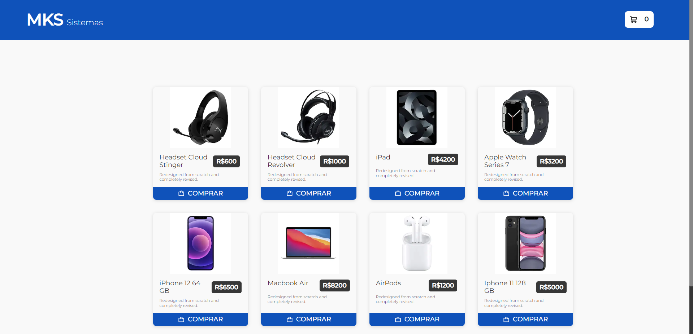

# MKS-Challenge



> Desafio Técnico proposto pela MKS Sistemas

Essa aplicação foi desenvolvida através de um desafio técnico, onde o propósito foi simular um e-commerce. Foi aplicado o conceito de SSG do Next.js e utilização de uma API disponibilizada para buscar os produtos. 

This application was developed through a technical challenge, where the purpose was to simulate an e-commerce. Next.js SSG concept was applied and an API available to search for products was used.

## 🛠 Technologies

- React
- TypeScript
- Next.js
- Styled-Component
- Redux Toolkit
- Axios
- Jest

## 💻 Applications

- React Hooks
- Immutability
- Props
- Components
- SSG
- API Consumption

## 🪄 How to use?

### Abra o terminal e copie este repositório em alguma pasta com o comando | Open terminal and copy this repository at some dir with the comand
```
$ git clone https://github.com/lucadboer/mks-challenge.git
```

### Acesse a pasta do projeto no prompt de comando ou pelo mouse | Access dir of the project in cmd or by mouse

```
$ cd mks-challenge
```

### Instale as dependências da aplicação | Install the dependecies of the application

```
$ npm install
or
$ yarn install
```

### Execute a aplicação | Run the application

```
$ npm run dev
or
$ yarn run dev
```

### Depois desses processos acesse http://localhost:3000 no seu navegador. | After this proccess access http://localhost:3000 in your browser

##

### Para os testes rode | for the tests run

```
$ npm test
or
$ yarn run test
```

## 💛 Contact

- Email --> luca.boer@outlook.com
- Linkedin --> https://www.linkedin.com/in/luca-destefano-boer/
- Portfolio --> https://about-luca.vercel.app/
